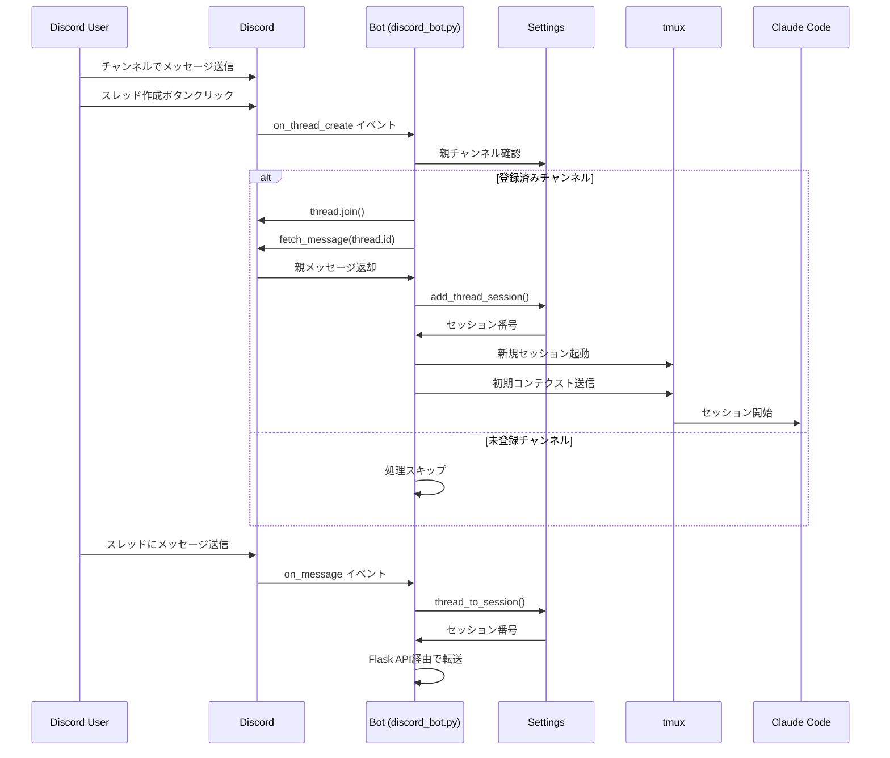

# スレッド専用セッション機能 設計書

## 1. 概要

本設計書は、Discord のスレッドごとに独立した Claude Code セッションを自動的に作成・管理する機能の技術設計を定義する。登録済みチャンネル内で作成されたスレッドを自動検出し、親メッセージを初期コンテクストとして含めた専用セッションを起動する。

## 2. アーキテクチャ

### 2.1 全体構成

```
Discord API
    ↓
[on_thread_create イベント]
    ↓
discord_bot.py
    ├── スレッド検出・検証
    ├── 親メッセージ取得
    ├── セッション作成
    └── 初期コンテクスト送信
         ↓
[on_message イベント]
    ↓
discord_bot.py
    ├── スレッドメッセージ処理
    └── Flask API 転送
         ↓
flask_app.py
    └── tmux セッションへ転送
         ↓
Claude Code セッション（tmux）
```

### 2.2 データフロー



## 3. コンポーネントと インターフェース

### 3.1 settings.py の拡張

#### 3.1.1 データ構造の変更

```python
class SettingsManager:
    def __init__(self):
        # 既存のチャンネル管理から移行
        self.channel_sessions = {}  # 廃止予定
        self.thread_sessions = {}   # thread_id -> session_number
        # self.registered_channels = []  # 未実装・廃止
```

#### 3.1.2 新規メソッド

```python
# 未実装・廃止
# def is_channel_registered(self, channel_id: str) -> bool:
#     """チャンネルが登録済みか確認"""
#     return channel_id in self.registered_channels

def thread_to_session(self, thread_id: str) -> Optional[int]:
    """スレッドIDからセッション番号を取得"""
    return self.thread_sessions.get(thread_id)

def add_thread_session(self, thread_id: str) -> int:
    """新規スレッド用セッションを割り当て"""
    existing_sessions = set(self.thread_sessions.values())
    session_num = 1
    while session_num in existing_sessions:
        session_num += 1
    
    self.thread_sessions[thread_id] = session_num
    self._save_settings()
    return session_num

def list_sessions(self) -> List[Tuple[int, str, str]]:
    """セッション一覧を返す (session_num, thread_id, type)"""
    sessions = []
    for thread_id, num in self.thread_sessions.items():
        sessions.append((num, thread_id, 'thread'))
    return sorted(sessions, key=lambda x: x[0])
```

### 3.2 discord_bot.py の変更

#### 3.2.1 Intents の設定

```python
def __init__(self, settings_manager: SettingsManager):
    # 既存の設定に追加
    intents = discord.Intents.default()
    intents.message_content = True
    intents.guilds = True  # on_thread_create に必要
```

#### 3.2.2 スレッド作成イベントハンドラー

```python
async def on_thread_create(self, thread):
    """新規スレッド作成時の処理"""
    # registered_channels機能は未実装のため、全てのスレッドを処理
    parent_channel_id = str(thread.parent_id)
    logger.info(f"Processing thread in channel: {parent_channel_id}")
    
    # スレッドに参加
    await thread.join()
    logger.info(f"Joined thread: {thread.name} (ID: {thread.id})")
    
    # セッション作成
    thread_id = str(thread.id)
    session_num = self.settings.add_thread_session(thread_id)
    
    # 親メッセージ取得と初期コンテクスト設定
    try:
        parent_message = await thread.parent.fetch_message(thread.id)
        await self._start_claude_session_with_context(
            session_num,
            thread.name,
            parent_message
        )
    except Exception as e:
        logger.error(f"Failed to fetch parent message: {e}")
        # 親メッセージなしでもセッションは起動
        await self._start_claude_session(session_num, thread.name)
```

#### 3.2.3 初期コンテクスト付きセッション起動

```python
async def _start_claude_session_with_context(self, session_num: int, 
                                            thread_name: str, 
                                            parent_message):
    """親メッセージを初期コンテクストとしてセッションを起動"""
    session_name = f"claude-session-{session_num}"
    
    # tmuxセッション起動
    cmd = ['tmux', 'new-session', '-d', '-s', session_name, 'claude', 'code']
    try:
        subprocess.run(cmd, check=True)
        logger.info(f"Started session {session_num} for thread: {thread_name}")
        
        # 初期コンテクストの送信（少し待機）
        await asyncio.sleep(2)
        
        # 初期メッセージのフォーマット
        context_message = (
            f"=== スレッド: {thread_name} ===\n"
            f"親メッセージ作成者: {parent_message.author.name}\n"
            f"親メッセージ時刻: {parent_message.created_at.strftime('%Y-%m-%d %H:%M:%S')}\n"
            f"親メッセージ内容:\n{parent_message.content}\n"
            f"=== スレッド開始 ==="
        )
        
        # tmuxにメッセージ送信
        subprocess.run([
            'tmux', 'send-keys', '-t', session_name, 
            context_message, 'C-m'
        ], check=True)
        
    except subprocess.CalledProcessError as e:
        logger.error(f"Failed to start session: {e}")
```

#### 3.2.4 メッセージ処理の変更

```python
async def on_message(self, message):
    """メッセージ受信時の処理"""
    # Bot自身のメッセージは無視
    if message.author == self.user:
        return
    
    # スレッド以外は処理しない
    if message.channel.type != discord.ChannelType.public_thread:
        return
    
    # セッション確認
    thread_id = str(message.channel.id)
    session_num = self.settings.thread_to_session(thread_id)
    
    if session_num is None:
        # 既存スレッドで初回メッセージの場合
        # （Bot起動前に作成されたスレッドへの対応）
        # registered_channels機能は未実装のため、全てのスレッドを処理
        session_num = self.settings.add_thread_session(thread_id)
        await message.channel.join()  # スレッドに参加
        await self._start_claude_session(session_num, message.channel.name)
    
    # 以降は既存の処理と同様
    loading_msg = await self._send_loading_feedback(message.channel)
    # ... メッセージ転送処理
```

### 3.3 コマンドライン拡張（bin/vai）

#### 3.3.1 list-session コマンドの更新

```bash
list_sessions() {
    echo -e "${GREEN}=== Active Sessions ===${NC}"
    echo
    
    # settings.json から情報を読み取る
    if [ -f "$CONFIG_FILE" ]; then
        # thread_sessions の表示
        echo -e "${BLUE}Thread Sessions:${NC}"
        jq -r '.thread_sessions | to_entries | .[] | "Session \(.value): Thread \(.key)"' "$CONFIG_FILE" 2>/dev/null || echo "No thread sessions"
        
        echo
        
        # tmux セッション状態の確認
        echo -e "${BLUE}tmux Sessions:${NC}"
        tmux list-sessions 2>/dev/null | grep "claude-session-" || echo "No active tmux sessions"
    fi
}
```

## 4. データモデル

### 4.1 設定ファイル構造（~/.claude-discord/settings.json）

```json
{
    "discord_token": "...",
    "thread_sessions": {
        "thread_id_1": 1,
        "thread_id_2": 2
    },
    "default_session": 1,
    "ports": {
        "flask": 5000
    }
}
```

注: `registered_channels`フィールドは設計段階のもので、実装されていません。

### 4.2 セッション情報

| フィールド | 型 | 説明 |
|-----------|-----|------|
| thread_id | string | Discord スレッドID |
| session_number | integer | tmux セッション番号 |
| created_at | datetime | セッション作成時刻（ログのみ） |
| thread_name | string | スレッド名（ログのみ） |

## 5. エラーハンドリング

### 5.1 スレッド作成時のエラー

| エラー状況 | 処理 |
|-----------|------|
| ~~親チャンネル未登録~~ | ~~ログ記録して処理スキップ~~（registered_channels機能は未実装） |
| thread.join() 失敗 | エラーログ記録、処理継続 |
| 親メッセージ取得失敗 | コンテクストなしでセッション起動 |
| tmux セッション起動失敗 | エラーログ記録、ユーザーに通知 |

### 5.2 メッセージ処理時のエラー

| エラー状況 | 処理 |
|-----------|------|
| セッション未作成 | 新規作成を試行 |
| Flask API 接続失敗 | エラーメッセージ表示 |
| tmux 転送失敗 | エラーメッセージ表示 |

## 6. テスト戦略

### 6.1 単体テスト

1. **SettingsManager のテスト**
   - `is_channel_registered()` の動作確認
   - `add_thread_session()` の番号割り当てロジック
   - 設定ファイルの読み書き

2. **イベントハンドラーのテスト**
   - モックを使用した `on_thread_create` の動作確認
   - 親メッセージ取得の成功・失敗ケース

### 6.2 統合テスト

1. **エンドツーエンドシナリオ**
   - スレッド作成 → セッション起動 → メッセージ処理
   - Bot 再起動後の既存スレッド処理

2. **エラーシナリオ**
   - tmux セッション上限到達時の動作

### 6.3 手動テスト項目

1. Discord UI でのスレッド作成
2. 親メッセージの内容が正しく転送されるか
3. 複数スレッドの同時処理
4. Bot 再起動後の動作確認

## 7. 移行計画

### 7.1 既存システムからの移行

1. **設定ファイルの変更**
   - `channel_sessions` を削除
   - `thread_sessions` を新規追加
   - ~~`registered_channels` を新規追加~~（未実装）

2. **即時切り替え**
   - チャンネルベースの処理を完全に削除
   - スレッドベースの処理のみを実装

## 8. セキュリティ考慮事項

1. **権限管理**
   - ~~登録チャンネルのみでスレッド作成を受け付ける~~（registered_channels機能は未実装）
   - Bot の権限は最小限に設定

2. **リソース制限**
   - 最大セッション数の制限
   - レート制限の実装検討

3. **ログ管理**
   - 適切なログレベルの設定
   - エラー情報の記録

## 9. パフォーマンス考慮事項

1. **スケーラビリティ**
   - 同時スレッド数の上限設定（初期値: 100）
   - tmux セッションのリソース使用量監視

2. **レスポンス時間**
   - スレッド作成から応答まで: 目標 5秒以内
   - 初期コンテクスト送信の非同期処理

## 10. 今後の拡張ポイント

1. **自動クリーンアップ**
   - アーカイブされたスレッドのセッション削除
   - 長期間非アクティブなセッションの削除

2. **高度な機能**
   - プライベートスレッドのサポート
   - フォーラムチャンネルの対応
   - セッション状態の永続化

3. **管理機能**
   - Web UI でのセッション管理
   - セッション使用統計の収集