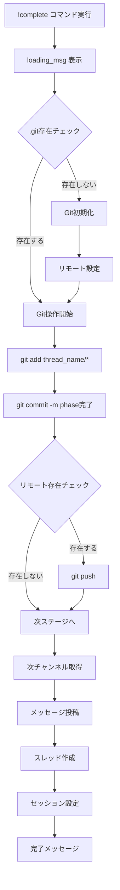
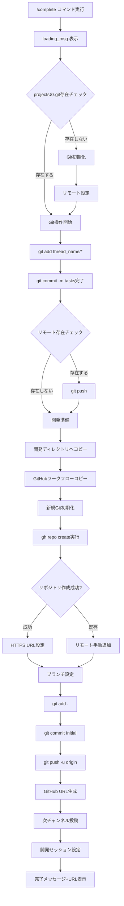

# Git操作重複の詳細分析とリファクタリング計画

## 1. 現状の問題分析

### 1.1 重複箇所の特定

現在、`command_manager.py`の以下4つのメソッドで、ほぼ同一のGit操作コードが重複しています：

1. `handle_idea_complete()` (行105-133)
2. `handle_requirements_complete()` (行179-204)
3. `handle_design_complete()` (行251-276)
4. `handle_tasks_complete()` (行323-348) **※追加処理あり**

**重要**: `handle_tasks_complete`には、他の3つにはない以下の特別な処理が含まれています：
- 開発ディレクトリへのプロジェクトコピー（行349-354）
- GitHubワークフローのコピー（行356-357）
- 開発ディレクトリでの新規Git初期化（行359-363）
- GitHubリポジトリの作成（`gh repo create`）（行365-403）
- ブランチ設定と初期コミット・プッシュ（行405-458）
- GitHub URLの生成と開発セッション設定（行460-478）

### 1.2 現在のGit操作フロー

#### 通常のフェーズ（idea, requirements, design）のフロー：



#### tasksフェーズの特別なフロー：



## 2. 現状のコード実装詳細

### 2.1 handle_idea_complete の Git操作部分

```python
# 1. プロジェクトルートのGitリポジトリチェック（行99-104）
if not (projects_root / ".git").exists():
    success, output = await self.bot.project_manager.init_git_repository(projects_root)
    if not success:
        await loading_msg.edit(content=f"❌ Git初期化エラー:\n```\n{output}\n```")
        return
    
    # 初回の場合、リモートリポジトリを設定
    await loading_msg.edit(content="`...` プロジェクトリポジトリを設定中...")
    await self._setup_projects_remote(projects_root, loading_msg)

# 2. Git操作コマンドの定義（行106-109）
git_commands = [
    ["git", "add", f"{thread_name}/*"],
    ["git", "commit", "-m", f"[{thread_name}] Complete idea phase"]
]

# 3. リモート確認とpush追加（行112-114）
has_remote = await self._check_git_remote(projects_root)
if has_remote:
    git_commands.append(["git", "push"])

# 4. コマンド実行ループ（行116-131）
for cmd in git_commands:
    success, output = await self.bot.project_manager.execute_git_command(projects_root, cmd)
    if not success:
        # エラーハンドリング（3パターン）
        if cmd[1] == "push":
            logger.warning(f"Git push failed (may not have remote): {output}")
        elif cmd[1] == "commit" and "nothing to commit" in output.lower():
            logger.info("Nothing to commit, continuing...")
            await loading_msg.edit(content="`...` コミットする変更がありません。次のステップに進みます...")
            break
        else:
            error_detail = output if output else f"Command failed: {' '.join(cmd)}"
            await loading_msg.edit(content=f"❌ Gitエラー:\n```\n{error_detail}\n```")
            return
```

### 2.2 各メソッドの違い（わずか）

| メソッド | コミットメッセージ | 次チャンネル | 次ステージ |
|---------|------------------|------------|-----------|
| handle_idea_complete | `[{thread_name}] Complete idea phase` | requirements | requirements |
| handle_requirements_complete | `[{thread_name}] Complete requirements phase` | design | design |
| handle_design_complete | `[{thread_name}] Complete design phase` | tasks | tasks |
| handle_tasks_complete | `[{thread_name}] Complete tasks phase` | development | development |

**相違点はわずか3箇所のみ：**
1. コミットメッセージのフェーズ名
2. 次のチャンネル名
3. 次のステージ名

## 3. リファクタリング後の構造

### 3.1 新しい共通メソッド（通常フェーズ用）

```python
async def _execute_git_workflow(
    self,
    projects_root: Path,
    thread_name: str,
    phase_name: str,
    loading_msg: discord.Message
) -> bool:
    """
    Git操作の共通ワークフロー実行
    
    Args:
        projects_root: プロジェクトのルートディレクトリ
        thread_name: スレッド名（プロジェクト名）
        phase_name: フェーズ名（idea, requirements, design, tasks）
        loading_msg: 進捗表示用メッセージ
    
    Returns:
        bool: 成功した場合True、失敗した場合False
    """
    # 1. Gitリポジトリ初期化チェック
    if not (projects_root / ".git").exists():
        success, output = await self.bot.project_manager.init_git_repository(projects_root)
        if not success:
            await loading_msg.edit(content=f"❌ Git初期化エラー:\n```\n{output}\n```")
            return False
        
        # 初回の場合、リモートリポジトリを設定
        await loading_msg.edit(content="`...` プロジェクトリポジトリを設定中...")
        await self._setup_projects_remote(projects_root, loading_msg)
    
    # 2. Git操作コマンドの定義
    git_commands = [
        ["git", "add", f"{thread_name}/*"],
        ["git", "commit", "-m", f"[{thread_name}] Complete {phase_name} phase"]
    ]
    
    # 3. リモート確認とpush追加
    has_remote = await self._check_git_remote(projects_root)
    if has_remote:
        git_commands.append(["git", "push"])
    
    # 4. コマンド実行
    for cmd in git_commands:
        success, output = await self.bot.project_manager.execute_git_command(projects_root, cmd)
        if not success:
            # pushエラーの場合は警告のみ
            if cmd[1] == "push":
                logger.warning(f"Git push failed (may not have remote): {output}")
            # commitエラーで「nothing to commit」の場合は警告のみ
            elif cmd[1] == "commit" and "nothing to commit" in output.lower():
                logger.info("Nothing to commit, continuing...")
                await loading_msg.edit(content="`...` コミットする変更がありません。次のステップに進みます...")
                break  # commitがスキップされたらpushもスキップ
            else:
                error_detail = output if output else f"Command failed: {' '.join(cmd)}"
                await loading_msg.edit(content=f"❌ Gitエラー:\n```\n{error_detail}\n```")
                return False
    
    return True
```

### 3.2 ステージ遷移の共通化

```python
async def _transition_to_next_stage(
    self,
    ctx,
    thread_name: str,
    current_stage: str,
    next_stage: str,
    project_path: Path,
    loading_msg: discord.Message
) -> bool:
    """
    次のステージへの遷移処理
    
    Args:
        ctx: コマンドコンテキスト
        thread_name: スレッド名
        current_stage: 現在のステージ
        next_stage: 次のステージ
        project_path: プロジェクトパス
        loading_msg: 進捗表示用メッセージ
    
    Returns:
        bool: 成功した場合True、失敗した場合False
    """
    # メッセージフォーマット
    next_message = self.bot.context_manager.format_complete_message(current_stage, thread_name)
    
    # 次チャンネル取得
    next_channel = self.bot.channel_validator.get_required_channel(ctx.guild, next_stage)
    if not next_channel:
        await loading_msg.edit(content=f"❌ #{self._get_stage_number(next_stage)}-{next_stage}チャンネルが見つかりません")
        return False
    
    # メッセージ投稿とスレッド作成
    message = await next_channel.send(next_message)
    thread = await message.create_thread(name=thread_name)
    
    # セッション管理の更新
    await self._setup_next_stage_session(
        thread, thread_name, next_stage, project_path
    )
    
    # 成功メッセージ
    await loading_msg.edit(
        content=f"✅ {current_stage} フェーズが完了しました！\n次フェーズ: {next_channel.mention}"
    )
    
    return True
```

### 3.3 リファクタリング後の各メソッド

#### 通常フェーズ（idea, requirements, design）:

```python
async def handle_idea_complete(self, ctx) -> None:
    """#1-ideaでの!complete処理"""
    thread_name = ctx.channel.name
    loading_msg = await ctx.send("`...` 処理中...")
    
    try:
        # プロジェクトパスを取得
        project_path = self.bot.project_manager.get_project_path(thread_name)
        projects_root = self.bot.project_manager.projects_root
        
        # Git操作の実行（共通メソッド呼び出し）
        if not await self._execute_git_workflow(
            projects_root, thread_name, "idea", loading_msg
        ):
            return
        
        # 次ステージへの遷移（共通メソッド呼び出し）
        await self._transition_to_next_stage(
            ctx, thread_name, "idea", "requirements", 
            project_path, loading_msg
        )
        
    except Exception as e:
        logger.error(f"Error in handle_idea_complete: {e}", exc_info=True)
        await loading_msg.edit(content=f"❌ エラーが発生しました: {str(e)[:100]}")
```

#### tasksフェーズ（特別処理あり）:

```python
async def handle_tasks_complete(self, ctx) -> None:
    """#4-tasksでの!complete処理（GitHub リポジトリ作成を含む）"""
    thread_name = ctx.channel.name
    loading_msg = await ctx.send("`...` 処理中...")
    
    try:
        # プロジェクトパスを取得
        project_path = self.bot.project_manager.get_project_path(thread_name)
        projects_root = self.bot.project_manager.projects_root
        
        # 1. 通常のGit操作（共通メソッド呼び出し）
        if not await self._execute_git_workflow(
            projects_root, thread_name, "tasks", loading_msg
        ):
            return
        
        # 2. 開発環境セットアップ（tasks特有の処理）
        dev_path, github_url = await self._setup_development_environment(
            thread_name, loading_msg
        )
        if not dev_path:
            return  # エラーメッセージは既に表示済み
        
        # 3. 次ステージへの遷移（開発用の特別なセッション設定）
        next_message = self.bot.context_manager.format_complete_message("tasks", thread_name)
        next_channel = self.bot.channel_validator.get_required_channel(ctx.guild, "development")
        
        if not next_channel:
            await loading_msg.edit(content="❌ #5-developmentチャンネルが見つかりません")
            return
        
        message = await next_channel.send(next_message)
        thread = await message.create_thread(name=thread_name)
        
        # 開発用セッションの設定（作業ディレクトリは開発ディレクトリ）
        await self._setup_development_session(
            thread, thread_name, str(dev_path), github_url
        )
        
        await loading_msg.edit(
            content=f"✅ tasks フェーズが完了しました！\n"
            f"🚀 GitHubリポジトリ: {github_url}\n"
            f"次フェーズ: {next_channel.mention}"
        )
        
    except Exception as e:
        logger.error(f"Error in handle_tasks_complete: {e}", exc_info=True)
        await loading_msg.edit(content=f"❌ エラーが発生しました: {str(e)[:100]}")
```

### 3.4 tasks専用の開発環境セットアップメソッド

```python
async def _setup_development_environment(
    self,
    thread_name: str,
    loading_msg: discord.Message
) -> Tuple[Optional[Path], Optional[str]]:
    """
    開発環境のセットアップ（tasksフェーズ専用）
    
    Returns:
        Tuple[Optional[Path], Optional[str]]: (開発パス, GitHub URL) or (None, None) if error
    """
    try:
        # 開発ディレクトリへのコピー
        try:
            dev_path = self.bot.project_manager.copy_to_development(thread_name)
        except FileExistsError:
            await loading_msg.edit(content=f"❌ 開発ディレクトリ `{thread_name}` は既に存在します")
            return None, None
        
        # GitHubワークフローのコピー
        self.bot.project_manager.copy_github_workflows(thread_name)
        
        # 開発ディレクトリでGit初期化
        success, output = await self.bot.project_manager.init_git_repository(dev_path)
        if not success:
            await loading_msg.edit(content=f"❌ Git初期化エラー:\n```\n{output}\n```")
            return None, None
        
        # GitHubリポジトリ作成
        create_repo_cmd = ["gh", "repo", "create", thread_name, "--public", "--source=.", "--remote=origin"]
        success, output = await self._run_command(create_repo_cmd, cwd=str(dev_path))
        
        # HTTPS URL設定とリモート処理
        github_user = await self._get_github_user()
        https_url = f"https://github.com/{github_user}/{thread_name}.git"
        
        if success:
            # リモートURLをHTTPSに設定
            set_url_cmd = ["git", "remote", "set-url", "origin", https_url]
            await self.bot.project_manager.execute_git_command(dev_path, set_url_cmd)
        elif "already exists" in output.lower():
            # 既存リポジトリの場合、リモートを手動追加
            await self.bot.project_manager.execute_git_command(dev_path, ["git", "remote", "remove", "origin"])
            await self.bot.project_manager.execute_git_command(dev_path, ["git", "remote", "add", "origin", https_url])
        else:
            await loading_msg.edit(content=f"❌ GitHubリポジトリ作成エラー:\n```\n{output}\n```")
            return None, None
        
        # ブランチ設定
        success, branch_name = await self.bot.project_manager.execute_git_command(
            dev_path, ["git", "branch", "--show-current"]
        )
        if not success or not branch_name.strip():
            await self.bot.project_manager.execute_git_command(dev_path, ["git", "checkout", "-b", "main"])
            branch_name = "main"
        else:
            branch_name = branch_name.strip()
        
        # 初期コミットとプッシュ
        dev_git_commands = [
            ["git", "add", "."],
            ["git", "commit", "-m", "Initial commit"],
            ["git", "push", "-u", "origin", branch_name]
        ]
        
        for cmd in dev_git_commands:
            success, output = await self.bot.project_manager.execute_git_command(dev_path, cmd)
            if not success:
                # エラーハンドリング（省略版、実際は詳細なエラー処理）
                if cmd[1] == "commit" and "nothing to commit" in output.lower():
                    continue
                elif cmd[1] == "push" and "Permission denied" in output:
                    logger.warning(f"Push failed: {output}")
                    continue
        
        github_url = f"https://github.com/{github_user}/{thread_name}"
        return dev_path, github_url
        
    except Exception as e:
        logger.error(f"Error in _setup_development_environment: {e}", exc_info=True)
        await loading_msg.edit(content=f"❌ 開発環境セットアップエラー: {str(e)[:100]}")
        return None, None
```

## 4. リファクタリングによる改善点

### 4.1 コード量の削減

| 項目 | 現状 | リファクタリング後 | 削減率 |
|-----|------|-----------------|--------|
| handle_idea_complete | 55行 | 20行 | 64% |
| handle_requirements_complete | 70行 | 20行 | 71% |
| handle_design_complete | 70行 | 20行 | 71% |
| handle_tasks_complete（全体） | 188行 | 45行 | 76% |
| _execute_git_workflow（新規） | 0行 | 50行 | - |
| _transition_to_next_stage（新規） | 0行 | 30行 | - |
| _setup_development_environment（新規） | 0行 | 80行 | - |
| **合計** | **383行** | **245行** | **36%削減** |

### 4.2 保守性の向上

**変更前：**
- Git操作のロジック変更時、4箇所を修正する必要がある
- エラーハンドリングの改善時、4箇所を修正する必要がある
- バグ修正時、4箇所すべてを確認・修正する必要がある

**変更後：**
- すべての変更が1箇所（`_execute_git_workflow`）で完結
- エラーハンドリングの一元管理
- テストが簡潔に（1つの共通メソッドをテストすれば良い）

### 4.3 拡張性の向上

新しいフェーズを追加する場合：

**変更前：**
```python
# 新しいメソッド全体（70行）を書く必要がある
async def handle_newphase_complete(self, ctx) -> None:
    # Git初期化チェック（10行）
    # Git操作（30行）
    # 次ステージ遷移（30行）
```

**変更後：**
```python
# 共通メソッドを呼ぶだけ（20行）
async def handle_newphase_complete(self, ctx) -> None:
    # 共通メソッド呼び出し（5行）
    await self._execute_git_workflow(...)
    # 遷移メソッド呼び出し（5行）
    await self._transition_to_next_stage(...)
```

## 5. 実装スケジュール

### Phase 1: 準備（30分）
1. 現在のコードのバックアップ
2. テストケースの準備
3. 既存機能の動作確認

### Phase 2: 共通メソッド作成（1時間）
1. `_execute_git_workflow`メソッドの実装
2. `_transition_to_next_stage`メソッドの実装
3. ヘルパーメソッド（`_get_stage_number`など）の追加

### Phase 3: 既存メソッドのリファクタリング（2時間）
1. `handle_idea_complete`の修正
2. `handle_requirements_complete`の修正
3. `handle_design_complete`の修正
4. `handle_tasks_complete`の修正（Git部分のみ）

### Phase 4: テストと検証（1時間）
1. 各フェーズの動作テスト
2. エラーケースのテスト
3. パフォーマンス確認

## 6. リスクと対策

### 6.1 潜在的リスク

1. **後方互換性**: 既存の動作が変わる可能性
   - **対策**: 十分なテスト、段階的なデプロイ

2. **エラーハンドリングの変更**: 共通化により特殊ケースへの対応が難しくなる
   - **対策**: パラメータによる柔軟な設定

3. **デバッグの困難化**: 共通化により問題の特定が難しくなる
   - **対策**: 詳細なログ出力、明確なエラーメッセージ

### 6.2 成功基準

- [ ] すべての既存テストがパス
- [ ] 各フェーズの`!complete`コマンドが正常動作
- [ ] Git操作のエラーハンドリングが適切に機能
- [ ] コード行数が25%以上削減
- [ ] 新規バグの発生なし

## 7. まとめ

このリファクタリングにより：
- **コード量**: 383行 → 245行（36%削減）
- **重複箇所**: 4箇所 → 1箇所（通常Git操作）
- **保守ポイント**: 4箇所 → 2箇所（通常処理と特別処理）
- **テスト対象**: 4メソッド → 3共通メソッド
- **特別処理の分離**: tasksフェーズの開発環境セットアップを独立メソッド化

結果として、より保守しやすく、拡張しやすいコードベースが実現されます。特にtasksフェーズの特別な処理が明確に分離され、通常のGit操作との違いが明確になります。