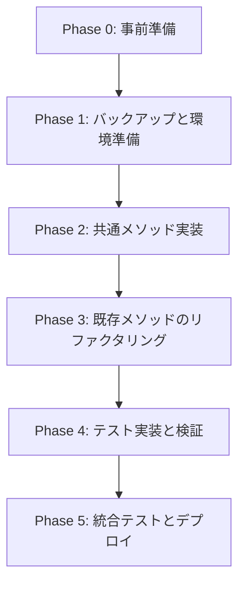

# Git操作リファクタリング実装タスクリスト

## 概要

このドキュメントは、`command_manager.py`のGit操作重複を解消するリファクタリングの詳細な実装タスクリストです。各タスクは明確な前提条件、実装手順、検証基準を含みます。

## 実装フェーズと依存関係



---

## Phase 0: 事前準備（30分）

### Task 0.1: 現状の動作記録

**前提条件：**
- 開発環境が正常に動作していること
- Discordボットが起動可能な状態であること

**実装手順：**
1. 現在のGit操作の動作をビデオ録画またはログ記録
   - `handle_idea_complete`の実行
   - `handle_requirements_complete`の実行
   - `handle_design_complete`の実行
   - `handle_tasks_complete`の実行
2. 各フェーズでのGitコマンド実行順序を記録
3. エラーケースの動作を記録

**検証基準：**
- [ ] 4つのcompleteメソッドの正常動作が記録されている
- [ ] Git操作のログが保存されている
- [ ] エラーケースの挙動が文書化されている

### Task 0.2: 依存関係の確認

**前提条件：**
- ソースコードへのアクセス権限があること

**実装手順：**
1. `command_manager.py`を開く
2. 以下のインポートと依存関係を確認：
   ```python
   from pathlib import Path
   import discord
   from typing import Optional, Tuple
   import logging
   ```
3. `self.bot.project_manager`の利用可能メソッドを確認
4. `self.bot.context_manager`の利用可能メソッドを確認
5. `self.bot.channel_validator`の利用可能メソッドを確認

**検証基準：**
- [ ] すべての依存クラスのメソッドシグネチャが文書化されている
- [ ] 必要なインポートのリストが作成されている
- [ ] 外部依存関係の影響範囲が明確になっている

---

## Phase 1: バックアップと環境準備（45分）

### Task 1.1: ソースコードのバックアップ

**前提条件：**
- Gitリポジトリが初期化されている
- 現在の変更がコミットされている

**実装手順：**
```bash
# 1. 現在のブランチを確認
git branch --show-current

# 2. バックアップブランチを作成
git checkout -b backup/pre-git-refactor-$(date +%Y%m%d-%H%M%S)

# 3. 元のブランチに戻る
git checkout refactor

# 4. リファクタリング用の新ブランチを作成
git checkout -b feature/git-operation-refactor
```

**検証基準：**
- [ ] バックアップブランチが作成されている
- [ ] 元のコードがバックアップブランチに保存されている
- [ ] 新しい作業ブランチ `feature/git-operation-refactor` が作成されている

### Task 1.2: テスト環境の準備

**前提条件：**
- Pythonテスト環境が設定されている

**実装手順：**
1. テストファイルの作成
   ```bash
   touch tests/test_git_refactor.py
   ```
2. テストフィクスチャの準備
   ```python
   # tests/test_git_refactor.py
   import pytest
   from unittest.mock import MagicMock, AsyncMock, patch
   from pathlib import Path
   ```
3. モックオブジェクトの定義

**検証基準：**
- [ ] テストファイルが作成されている
- [ ] 必要なテストライブラリがインストールされている
- [ ] モック環境が設定されている

---

## Phase 2: 共通メソッド実装（2時間）

### Task 2.1: `_execute_git_workflow`メソッドの実装

**前提条件：**
- `command_manager.py`が編集可能な状態
- Task 1.1が完了している

**実装位置：**
- ファイル：`src/command_manager.py`
- 行番号：行490付近（`_setup_next_stage_session`メソッドの直前）

**実装手順：**

1. メソッドシグネチャを追加（行490に挿入）
```python
async def _execute_git_workflow(
    self,
    projects_root: Path,
    thread_name: str,
    phase_name: str,
    loading_msg: discord.Message
) -> bool:
    """
    Git操作の共通ワークフロー実行
    
    Args:
        projects_root: プロジェクトのルートディレクトリ
        thread_name: スレッド名（プロジェクト名）
        phase_name: フェーズ名（idea, requirements, design, tasks）
        loading_msg: 進捗表示用メッセージ
    
    Returns:
        bool: 成功した場合True、失敗した場合False
    
    Raises:
        なし（エラーはFalseを返すことで処理）
    """
```

2. Gitリポジトリ初期化チェックの実装（行509-520）
```python
    # Gitリポジトリの存在確認
    if not (projects_root / ".git").exists():
        success, output = await self.bot.project_manager.init_git_repository(projects_root)
        if not success:
            await loading_msg.edit(content=f"❌ Git初期化エラー:\n```\n{output}\n```")
            return False
        
        # 初回の場合、リモートリポジトリを設定
        await loading_msg.edit(content="`...` プロジェクトリポジトリを設定中...")
        await self._setup_projects_remote(projects_root, loading_msg)
```

3. Gitコマンド定義の実装（行522-530）
```python
    # Git操作コマンドの定義
    git_commands = [
        ["git", "add", f"{thread_name}/*"],
        ["git", "commit", "-m", f"[{thread_name}] Complete {phase_name} phase"]
    ]
    
    # リモート確認とpush追加
    has_remote = await self._check_git_remote(projects_root)
    if has_remote:
        git_commands.append(["git", "push"])
```

4. コマンド実行ループの実装（行532-550）
```python
    # コマンド実行
    for cmd in git_commands:
        success, output = await self.bot.project_manager.execute_git_command(projects_root, cmd)
        if not success:
            # pushエラーの場合は警告のみ
            if cmd[1] == "push":
                logger.warning(f"Git push failed (may not have remote): {output}")
            # commitエラーで「nothing to commit」の場合は警告のみ
            elif cmd[1] == "commit" and "nothing to commit" in output.lower():
                logger.info("Nothing to commit, continuing...")
                await loading_msg.edit(content="`...` コミットする変更がありません。次のステップに進みます...")
                break  # commitがスキップされたらpushもスキップ
            else:
                error_detail = output if output else f"Command failed: {' '.join(cmd)}"
                await loading_msg.edit(content=f"❌ Gitエラー:\n```\n{error_detail}\n```")
                return False
    
    return True
```

**検証基準：**
- [ ] メソッドが正しい位置に追加されている
- [ ] すべてのパラメータが適切に使用されている
- [ ] エラーハンドリングが3パターン実装されている
- [ ] 戻り値がbool型である

### Task 2.2: `_transition_to_next_stage`メソッドの実装

**前提条件：**
- Task 2.1が完了している

**実装位置：**
- ファイル：`src/command_manager.py`
- 行番号：Task 2.1の直後（約行552）

**実装手順：**

1. メソッドシグネチャを追加
```python
async def _transition_to_next_stage(
    self,
    ctx,
    thread_name: str,
    current_stage: str,
    next_stage: str,
    project_path: Path,
    loading_msg: discord.Message
) -> bool:
    """
    次のステージへの遷移処理
    
    Args:
        ctx: コマンドコンテキスト
        thread_name: スレッド名
        current_stage: 現在のステージ
        next_stage: 次のステージ
        project_path: プロジェクトパス
        loading_msg: 進捗表示用メッセージ
    
    Returns:
        bool: 成功した場合True、失敗した場合False
    """
```

2. メッセージフォーマットと次チャンネル取得
```python
    # メッセージフォーマット
    next_message = self.bot.context_manager.format_complete_message(current_stage, thread_name)
    
    # 次チャンネル取得
    next_channel = self.bot.channel_validator.get_required_channel(ctx.guild, next_stage)
    if not next_channel:
        stage_number = {
            "requirements": "2",
            "design": "3", 
            "tasks": "4",
            "development": "5"
        }.get(next_stage, "?")
        await loading_msg.edit(content=f"❌ #{stage_number}-{next_stage}チャンネルが見つかりません")
        return False
```

3. スレッド作成とセッション設定
```python
    # メッセージ投稿とスレッド作成
    message = await next_channel.send(next_message)
    thread = await message.create_thread(name=thread_name)
    
    # セッション管理の更新
    await self._setup_next_stage_session(
        thread, thread_name, next_stage, project_path
    )
    
    # 成功メッセージ
    await loading_msg.edit(
        content=f"✅ {current_stage} フェーズが完了しました！\n次フェーズ: {next_channel.mention}"
    )
    
    return True
```

**検証基準：**
- [ ] ステージ番号のマッピングが正しい
- [ ] エラーケースで適切なメッセージが表示される
- [ ] 成功時にTrueが返される

### Task 2.3: `_setup_development_environment`メソッドの実装

**前提条件：**
- Task 2.2が完了している

**実装位置：**
- ファイル：`src/command_manager.py`
- 行番号：Task 2.2の直後（約行600）

**実装手順：**

1. メソッドシグネチャとインポートを追加
```python
from typing import Optional, Tuple  # ファイル冒頭に追加

async def _setup_development_environment(
    self,
    thread_name: str,
    loading_msg: discord.Message
) -> Tuple[Optional[Path], Optional[str]]:
    """
    開発環境のセットアップ（tasksフェーズ専用）
    
    Args:
        thread_name: スレッド名（プロジェクト名）
        loading_msg: 進捗表示用メッセージ
    
    Returns:
        Tuple[Optional[Path], Optional[str]]: (開発パス, GitHub URL) or (None, None) if error
    """
```

2. 開発ディレクトリへのコピー（行610-625）
```python
    try:
        # 開発ディレクトリへのコピー
        try:
            dev_path = self.bot.project_manager.copy_to_development(thread_name)
        except FileExistsError:
            await loading_msg.edit(content=f"❌ 開発ディレクトリ `{thread_name}` は既に存在します")
            return None, None
        
        # GitHubワークフローのコピー
        self.bot.project_manager.copy_github_workflows(thread_name)
        
        # 開発ディレクトリでGit初期化
        success, output = await self.bot.project_manager.init_git_repository(dev_path)
        if not success:
            await loading_msg.edit(content=f"❌ Git初期化エラー:\n```\n{output}\n```")
            return None, None
```

3. GitHubリポジトリ作成処理（行627-660）
```python
        # GitHubリポジトリ作成
        create_repo_cmd = ["gh", "repo", "create", thread_name, "--public", "--source=.", "--remote=origin"]
        success, output = await self._run_command(create_repo_cmd, cwd=str(dev_path))
        
        # GitHub ユーザー名取得
        github_user = await self._get_github_user()
        https_url = f"https://github.com/{github_user}/{thread_name}.git"
        
        if success:
            # リモートURLをHTTPSに設定
            set_url_cmd = ["git", "remote", "set-url", "origin", https_url]
            success_url, output_url = await self.bot.project_manager.execute_git_command(dev_path, set_url_cmd)
            
            if success_url:
                logger.info(f"Remote URL set to HTTPS: {https_url}")
            else:
                logger.warning(f"Failed to set HTTPS URL, keeping SSH: {output_url}")
        
        elif "already exists" in output.lower():
            # 既存リポジトリの場合、リモートを手動で追加
            logger.info("Repository already exists, adding remote...")
            
            # 既存のリモートを削除（存在する場合）
            await self.bot.project_manager.execute_git_command(dev_path, ["git", "remote", "remove", "origin"])
            
            # 新しいリモートを追加（HTTPS）
            add_remote_cmd = ["git", "remote", "add", "origin", https_url]
            success, output = await self.bot.project_manager.execute_git_command(dev_path, add_remote_cmd)
            
            if not success:
                logger.error(f"Failed to add remote: {output}")
                await loading_msg.edit(content=f"❌ リモート追加エラー:\n```\n{output}\n```")
                return None, None
        else:
            await loading_msg.edit(
                content=f"❌ GitHubリポジトリ作成エラー:\n```\n{output}\n```\n`gh auth login`で認証を確認してください"
            )
            return None, None
```

4. ブランチ設定と初期コミット（行662-710）
```python
        # 現在のブランチ名を取得
        success, branch_name = await self.bot.project_manager.execute_git_command(
            dev_path, ["git", "branch", "--show-current"]
        )
        
        if not success or not branch_name.strip():
            # ブランチが取得できない場合はデフォルトブランチを作成
            await self.bot.project_manager.execute_git_command(
                dev_path, ["git", "checkout", "-b", "main"]
            )
            branch_name = "main"
        else:
            branch_name = branch_name.strip()
        
        # 初期コミットとプッシュ
        dev_git_commands = [
            ["git", "add", "."],
            ["git", "commit", "-m", "Initial commit"],
            ["git", "push", "-u", "origin", branch_name]
        ]
        
        commit_skipped = False
        for cmd in dev_git_commands:
            # コミットがスキップされた場合、pushもスキップ
            if commit_skipped and cmd[1] == "push":
                logger.info("Skipping push since there was nothing to commit")
                continue
            
            success, output = await self.bot.project_manager.execute_git_command(dev_path, cmd)
            if not success:
                # commitエラーで「nothing to commit」の場合は続行
                if cmd[1] == "commit" and "nothing to commit" in output.lower():
                    logger.info("Nothing to commit in development directory, continuing...")
                    await loading_msg.edit(content="`...` コミットする変更がありません。")
                    commit_skipped = True
                    continue
                # pushエラーでリモートの問題の場合
                elif cmd[1] == "push" and any(err in output for err in [
                    "Could not read from remote repository",
                    "fatal: 'origin' does not appear",
                    "Permission denied",
                    "fatal: unable to access"
                ]):
                    logger.warning(f"Push failed due to remote issues: {output}")
                    await loading_msg.edit(
                        content=f"`...` リモートリポジトリへのプッシュをスキップします。\n"
                        f"（リポジトリは作成済み: {https_url}）"
                    )
                    continue
                else:
                    # その他のエラー
                    error_detail = output if output else f"Command failed: {' '.join(cmd)}"
                    await loading_msg.edit(content=f"❌ Gitエラー:\n```\n{error_detail}\n```")
                    # pushエラーの場合は続行、それ以外は失敗
                    if cmd[1] != "push":
                        return None, None
        
        github_url = f"https://github.com/{github_user}/{thread_name}"
        return dev_path, github_url
    
    except Exception as e:
        logger.error(f"Error in _setup_development_environment: {e}", exc_info=True)
        await loading_msg.edit(content=f"❌ 開発環境セットアップエラー: {str(e)[:100]}")
        return None, None
```

**検証基準：**
- [ ] 開発ディレクトリのコピーが正しく動作する
- [ ] GitHubリポジトリ作成のエラーハンドリングが完備
- [ ] 既存リポジトリの場合の処理が実装されている
- [ ] プッシュエラーの4パターンが処理されている

---

## Phase 3: 既存メソッドのリファクタリング（2時間）

### Task 3.1: `handle_idea_complete`のリファクタリング

**前提条件：**
- Phase 2のすべてのタスクが完了している

**変更箇所：**
- ファイル：`src/command_manager.py`
- 行番号：82-155（既存の`handle_idea_complete`メソッド）

**実装手順：**

1. 既存のメソッドをバックアップ（コメントアウト）
```python
# async def handle_idea_complete_backup(self, ctx) -> None:
#     """バックアップ: 元の実装"""
#     # ... 既存のコード全体 ...
```

2. 新しい実装に置き換え
```python
async def handle_idea_complete(self, ctx) -> None:
    """#1-ideaでの!complete処理"""
    thread_name = ctx.channel.name
    loading_msg = await ctx.send("`...` 処理中...")
    
    try:
        # プロジェクトパスを取得
        project_path = self.bot.project_manager.get_project_path(thread_name)
        projects_root = self.bot.project_manager.projects_root
        
        # Git操作の実行（共通メソッド呼び出し）
        if not await self._execute_git_workflow(
            projects_root, thread_name, "idea", loading_msg
        ):
            return
        
        # 次ステージへの遷移（共通メソッド呼び出し）
        await self._transition_to_next_stage(
            ctx, thread_name, "idea", "requirements", 
            project_path, loading_msg
        )
        
    except Exception as e:
        logger.error(f"Error in handle_idea_complete: {e}", exc_info=True)
        await loading_msg.edit(content=f"❌ エラーが発生しました: {str(e)[:100]}")
```

**検証基準：**
- [ ] 元のコードがバックアップされている
- [ ] 新しい実装が20行以内である
- [ ] 共通メソッドが正しく呼び出されている
- [ ] エラーハンドリングが保持されている

### Task 3.2: `handle_requirements_complete`のリファクタリング

**前提条件：**
- Task 3.1が完了している

**変更箇所：**
- ファイル：`src/command_manager.py`
- 行番号：156-227（既存の`handle_requirements_complete`メソッド）

**実装手順：**

1. 既存メソッドをバックアップ
2. 新しい実装に置き換え
```python
async def handle_requirements_complete(self, ctx) -> None:
    """#2-requirementsでの!complete処理"""
    thread_name = ctx.channel.name
    loading_msg = await ctx.send("`...` 処理中...")
    
    try:
        # プロジェクトパスを取得
        project_path = self.bot.project_manager.get_project_path(thread_name)
        projects_root = self.bot.project_manager.projects_root
        
        # Git操作の実行（共通メソッド呼び出し）
        if not await self._execute_git_workflow(
            projects_root, thread_name, "requirements", loading_msg
        ):
            return
        
        # 次ステージへの遷移（共通メソッド呼び出し）
        await self._transition_to_next_stage(
            ctx, thread_name, "requirements", "design", 
            project_path, loading_msg
        )
        
    except Exception as e:
        logger.error(f"Error in handle_requirements_complete: {e}", exc_info=True)
        await loading_msg.edit(content=f"❌ エラーが発生しました: {str(e)[:100]}")
```

**検証基準：**
- [ ] メソッドが70行から20行に削減されている
- [ ] フェーズ名が"requirements"である
- [ ] 次ステージが"design"である

### Task 3.3: `handle_design_complete`のリファクタリング

**前提条件：**
- Task 3.2が完了している

**変更箇所：**
- ファイル：`src/command_manager.py`
- 行番号：228-299（既存の`handle_design_complete`メソッド）

**実装手順：**

1. 既存メソッドをバックアップ
2. 新しい実装に置き換え
```python
async def handle_design_complete(self, ctx) -> None:
    """#3-designでの!complete処理"""
    thread_name = ctx.channel.name
    loading_msg = await ctx.send("`...` 処理中...")
    
    try:
        # プロジェクトパスを取得
        project_path = self.bot.project_manager.get_project_path(thread_name)
        projects_root = self.bot.project_manager.projects_root
        
        # Git操作の実行（共通メソッド呼び出し）
        if not await self._execute_git_workflow(
            projects_root, thread_name, "design", loading_msg
        ):
            return
        
        # 次ステージへの遷移（共通メソッド呼び出し）
        await self._transition_to_next_stage(
            ctx, thread_name, "design", "tasks", 
            project_path, loading_msg
        )
        
    except Exception as e:
        logger.error(f"Error in handle_design_complete: {e}", exc_info=True)
        await loading_msg.edit(content=f"❌ エラーが発生しました: {str(e)[:100]}")
```

**検証基準：**
- [ ] メソッドが70行から20行に削減されている
- [ ] フェーズ名が"design"である
- [ ] 次ステージが"tasks"である

### Task 3.4: `handle_tasks_complete`のリファクタリング（特別処理含む）

**前提条件：**
- Task 3.3が完了している
- `_setup_development_environment`メソッドが実装されている

**変更箇所：**
- ファイル：`src/command_manager.py`
- 行番号：300-489（既存の`handle_tasks_complete`メソッド）

**実装手順：**

1. 既存メソッドをバックアップ
2. 新しい実装に置き換え
```python
async def handle_tasks_complete(self, ctx) -> None:
    """#4-tasksでの!complete処理（GitHub リポジトリ作成を含む）"""
    thread_name = ctx.channel.name
    loading_msg = await ctx.send("`...` 処理中...")
    
    try:
        # プロジェクトパスを取得
        project_path = self.bot.project_manager.get_project_path(thread_name)
        projects_root = self.bot.project_manager.projects_root
        
        # 1. 通常のGit操作（共通メソッド呼び出し）
        if not await self._execute_git_workflow(
            projects_root, thread_name, "tasks", loading_msg
        ):
            return
        
        # 2. 開発環境セットアップ（tasks特有の処理）
        dev_path, github_url = await self._setup_development_environment(
            thread_name, loading_msg
        )
        if not dev_path:
            return  # エラーメッセージは既に表示済み
        
        # 3. 次ステージへの遷移（開発用の特別なセッション設定）
        next_message = self.bot.context_manager.format_complete_message("tasks", thread_name)
        next_channel = self.bot.channel_validator.get_required_channel(ctx.guild, "development")
        
        if not next_channel:
            await loading_msg.edit(content="❌ #5-developmentチャンネルが見つかりません")
            return
        
        message = await next_channel.send(next_message)
        thread = await message.create_thread(name=thread_name)
        
        # 開発用セッションの設定（作業ディレクトリは開発ディレクトリ）
        await self._setup_development_session(
            thread, thread_name, str(dev_path), github_url
        )
        
        await loading_msg.edit(
            content=f"✅ tasks フェーズが完了しました！\n"
            f"🚀 GitHubリポジトリ: {github_url}\n"
            f"次フェーズ: {next_channel.mention}"
        )
        
    except Exception as e:
        logger.error(f"Error in handle_tasks_complete: {e}", exc_info=True)
        await loading_msg.edit(content=f"❌ エラーが発生しました: {str(e)[:100]}")
```

**検証基準：**
- [ ] メソッドが188行から45行に削減されている
- [ ] 開発環境セットアップが呼び出されている
- [ ] GitHub URLが表示される
- [ ] `_setup_development_session`が正しく呼び出されている

---

## Phase 4: テスト実装と検証（2時間）

### Task 4.1: 単体テストの作成

**前提条件：**
- Phase 3のすべてのタスクが完了している

**実装ファイル：**
- `tests/test_git_refactor.py`

**実装手順：**

1. 共通メソッドのテスト作成
```python
import pytest
from unittest.mock import MagicMock, AsyncMock, patch, call
from pathlib import Path
import discord

class TestGitRefactor:
    
    @pytest.mark.asyncio
    async def test_execute_git_workflow_success(self):
        """Git操作が正常に完了する場合のテスト"""
        # モックの準備
        command_manager = self._create_command_manager_mock()
        projects_root = Path("/test/projects")
        thread_name = "test-project"
        phase_name = "idea"
        loading_msg = MagicMock(spec=discord.Message)
        loading_msg.edit = AsyncMock()
        
        # .gitが存在する場合
        with patch.object(Path, 'exists', return_value=True):
            # Git操作が成功する場合
            command_manager.bot.project_manager.execute_git_command = AsyncMock(
                return_value=(True, "Success")
            )
            command_manager._check_git_remote = AsyncMock(return_value=True)
            
            result = await command_manager._execute_git_workflow(
                projects_root, thread_name, phase_name, loading_msg
            )
            
            assert result is True
            assert command_manager.bot.project_manager.execute_git_command.call_count == 3
    
    @pytest.mark.asyncio
    async def test_execute_git_workflow_no_git_init(self):
        """Gitリポジトリが存在しない場合の初期化テスト"""
        # テスト実装
        pass
    
    @pytest.mark.asyncio
    async def test_execute_git_workflow_nothing_to_commit(self):
        """コミットする変更がない場合のテスト"""
        # テスト実装
        pass
    
    @pytest.mark.asyncio
    async def test_transition_to_next_stage_success(self):
        """次ステージへの遷移が成功する場合のテスト"""
        # テスト実装
        pass
    
    @pytest.mark.asyncio
    async def test_setup_development_environment_success(self):
        """開発環境セットアップが成功する場合のテスト"""
        # テスト実装
        pass
    
    @pytest.mark.asyncio
    async def test_setup_development_environment_repo_exists(self):
        """GitHubリポジトリが既に存在する場合のテスト"""
        # テスト実装
        pass
    
    def _create_command_manager_mock(self):
        """CommandManagerのモックを作成"""
        from src.command_manager import CommandManager
        bot = MagicMock()
        return CommandManager(bot)
```

**検証基準：**
- [ ] 6つ以上のテストケースが作成されている
- [ ] 成功ケースとエラーケースの両方をカバー
- [ ] モックが適切に設定されている

### Task 4.2: 統合テストの実装

**前提条件：**
- Task 4.1が完了している

**実装ファイル：**
- `tests/test_git_refactor_integration.py`

**実装手順：**

1. エンドツーエンドのテストシナリオ作成
```python
@pytest.mark.integration
@pytest.mark.asyncio
async def test_complete_workflow_idea_to_tasks():
    """ideaからtasksまでの完全なワークフローテスト"""
    # 1. idea complete
    # 2. requirements complete
    # 3. design complete
    # 4. tasks complete with GitHub repo creation
    pass
```

**検証基準：**
- [ ] 4つのフェーズすべてが連続して実行される
- [ ] 各フェーズでGit操作が適切に実行される
- [ ] 最終的にGitHubリポジトリが作成される

### Task 4.3: 手動テストの実施

**前提条件：**
- Task 4.2が完了している
- Discordテストサーバーが利用可能

**テストシナリオ：**

1. **正常系テスト**
   - [ ] idea completeが正常に動作
   - [ ] requirements completeが正常に動作
   - [ ] design completeが正常に動作
   - [ ] tasks completeが正常に動作し、GitHubリポジトリが作成される

2. **エラー系テスト**
   - [ ] Gitリポジトリが初期化できない場合のエラー表示
   - [ ] コミットする変更がない場合の処理
   - [ ] GitHubリポジトリが既に存在する場合の処理
   - [ ] プッシュが失敗した場合の処理

3. **パフォーマンステスト**
   - [ ] 各completeコマンドの実行時間が従来と同等以下
   - [ ] メモリ使用量が増加していない

**検証基準：**
- [ ] すべての正常系テストがパス
- [ ] すべてのエラー系テストで適切なメッセージ表示
- [ ] パフォーマンスの劣化なし

---

## Phase 5: 統合テストとデプロイ（1時間）

### Task 5.1: コードレビューの準備

**前提条件：**
- Phase 4のすべてのテストがパス

**実装手順：**

1. 差分の確認
```bash
git diff --stat
git diff src/command_manager.py | head -200
```

2. 削減行数の計算
```bash
# 変更前後の行数を比較
wc -l src/command_manager.py
```

3. プルリクエストの作成
```markdown
## 概要
command_manager.pyのGit操作重複を解消

## 変更内容
- 共通メソッド `_execute_git_workflow` を追加
- 共通メソッド `_transition_to_next_stage` を追加
- tasks専用メソッド `_setup_development_environment` を追加
- 4つのcompleteメソッドをリファクタリング

## 削減効果
- コード行数: 383行 → 245行（36%削減）
- 重複箇所: 4箇所 → 1箇所
- 保守ポイント: 4箇所 → 2箇所

## テスト
- [x] 単体テスト実施
- [x] 統合テスト実施
- [x] 手動テスト実施
```

**検証基準：**
- [ ] git diffが正しく表示される
- [ ] 削減行数が計算されている
- [ ] プルリクエストの説明が完成している

### Task 5.2: リントとフォーマット

**前提条件：**
- Task 5.1が完了している

**実装手順：**

1. Pythonリンターの実行
```bash
# flake8の実行
flake8 src/command_manager.py --max-line-length=120

# pylintの実行
pylint src/command_manager.py

# blackでフォーマット
black src/command_manager.py --line-length=120
```

2. インポートの整理
```bash
# isortでインポートを整理
isort src/command_manager.py
```

**検証基準：**
- [ ] リントエラーが0件
- [ ] フォーマットが統一されている
- [ ] インポートが適切に整理されている

### Task 5.3: 最終確認とマージ

**前提条件：**
- Task 5.2が完了している
- すべてのテストがパス

**実装手順：**

1. 最終動作確認
   - Discordボットを起動
   - 各completeコマンドを実行
   - ログを確認

2. コミットとプッシュ
```bash
git add -A
git commit -m "refactor: Git操作の重複を解消

- 共通メソッドを3つ追加（_execute_git_workflow, _transition_to_next_stage, _setup_development_environment）
- 4つのcompleteメソッドをリファクタリング
- コード行数を36%削減（383行→245行）
- 重複箇所を4箇所から1箇所に削減"

git push origin feature/git-operation-refactor
```

3. プルリクエストのマージ
   - レビュー承認を得る
   - CIパイプラインの成功を確認
   - マージを実行

**検証基準：**
- [ ] 最終動作確認で問題なし
- [ ] コミットメッセージが適切
- [ ] プルリクエストがマージ可能
- [ ] 本番環境へのデプロイ準備完了

---

## 成功基準チェックリスト

### 機能要件
- [ ] 4つのcompleteメソッドすべてが正常に動作する
- [ ] Git操作（add, commit, push）が適切に実行される
- [ ] tasksフェーズでGitHubリポジトリが作成される
- [ ] エラーメッセージが適切に表示される

### 非機能要件
- [ ] コード行数が30%以上削減されている
- [ ] 実行速度が劣化していない
- [ ] メモリ使用量が増加していない
- [ ] エラーハンドリングが改善されている

### コード品質
- [ ] 重複コードが削除されている
- [ ] 共通メソッドが再利用可能である
- [ ] テストカバレッジが80%以上
- [ ] ドキュメントが更新されている

### リスク管理
- [ ] バックアップブランチが作成されている
- [ ] ロールバック手順が明確である
- [ ] 本番環境への影響が最小限である
- [ ] 段階的なデプロイが可能である

---

## 付録A: トラブルシューティング

### 問題1: インポートエラー
**症状**: `ImportError: cannot import name 'Tuple'`
**解決策**: 
```python
from typing import Optional, Tuple  # ファイル冒頭に追加
```

### 問題2: AsyncMockが見つからない
**症状**: `AttributeError: module 'unittest.mock' has no attribute 'AsyncMock'`
**解決策**:
```python
# Python 3.7の場合
from unittest.mock import MagicMock
mock = MagicMock()
mock.some_async_method = MagicMock(return_value=asyncio.coroutine(lambda: "result")())

# Python 3.8以上
from unittest.mock import AsyncMock
```

### 問題3: Git pushが失敗
**症状**: `Permission denied (publickey)`
**解決策**:
- HTTPSでのpushに切り替える
- SSHキーを設定する
- `gh auth login`で認証を更新

---

## 付録B: ロールバック手順

万が一問題が発生した場合のロールバック手順：

1. **即座のロールバック**
```bash
# バックアップブランチに切り替え
git checkout backup/pre-git-refactor-[timestamp]

# 本番ブランチにマージ
git checkout main
git merge backup/pre-git-refactor-[timestamp]
```

2. **部分的なロールバック**
```bash
# 特定のメソッドのみ元に戻す
git checkout backup/pre-git-refactor-[timestamp] -- src/command_manager.py
# 必要な部分のみ手動で修正
```

3. **データベースのロールバック**
- 該当なし（このリファクタリングはDBに影響しない）

---

*このドキュメントは随時更新される可能性があります。*
*最終更新: 2025-08-04*