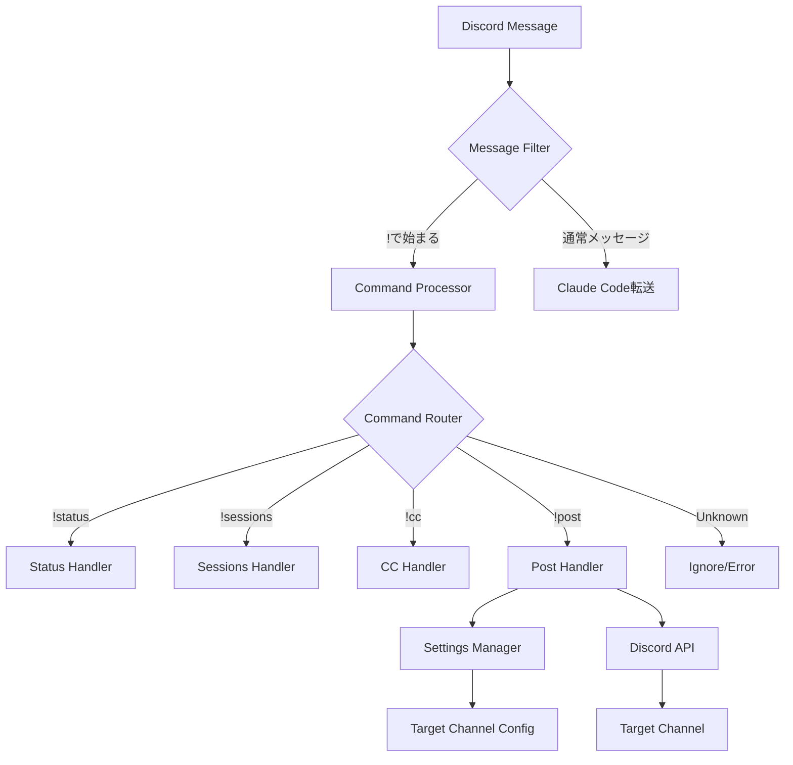

# Design Document

## Overview

この設計は、Discordで`!`プレフィックスを使用したコマンドシステムを実装します。主な機能は：

1. **!プレフィックスフィルタリング**: `!`で始まるメッセージがClaude Code（CC）に転送されないようにする
2. **!postコマンド**: スレッド内で実行すると、そのスレッド名を設定されたチャンネルに送信する

システムは既存のClaude-Discord Bridgeアーキテクチャを拡張し、最小限の変更で要件を実現します。

## Architecture

### コンポーネント相関図



### メッセージ処理フロー

1. **受信段階**: `discord_bot.py`の`on_message`ハンドラでメッセージを受信
2. **フィルタリング段階**: `!`プレフィックスを検出し、CCへの転送をスキップ
3. **コマンド処理段階**: discord.pyの標準コマンド処理機構で適切なハンドラに振り分け
4. **実行段階**: 各コマンドハンドラが処理を実行

## Components and Interfaces

### 1. MessageFilter (新規)

**場所**: `discord_bot.py`内の`on_message`メソッドを拡張

**責任**:
- `!`プレフィックスメッセージの検出
- CCへの転送スキップ判定

**インターフェース**:
```python
def should_forward_to_claude(self, message: discord.Message) -> bool:
    """
    メッセージをClaude Codeに転送すべきか判定
    
    Args:
        message: Discordメッセージオブジェクト
    
    Returns:
        bool: 転送する場合True、しない場合False
    """
```

### 2. PostCommand (新規)

**場所**: `discord_bot.py`の`create_bot_commands`関数内

**責任**:
- スレッド内実行の検証
- スレッド名の取得
- 設定されたチャンネルへの送信

**インターフェース**:
```python
@bot.command(name='post')
async def post_command(ctx):
    """
    現在のスレッド名を設定されたチャンネルに送信
    
    Args:
        ctx: discord.pyのコマンドコンテキスト
    """
```

### 3. SettingsManager拡張

**場所**: `config/settings.py`

**追加メソッド**:
```python
def get_post_target_channel(self) -> Optional[str]:
    """送信先チャンネルIDを取得"""
    
def set_post_target_channel(self, channel_id: str):
    """送信先チャンネルIDを設定"""
```

### 4. Discord APIインタラクション

**責任**:
- メッセージの送信
- エラーハンドリング
- 権限確認

既存の`discord_post.py`の`post_to_discord`関数を再利用します。

## Data Models

### 設定ファイル構造の拡張

`settings.json`に以下のフィールドを追加：

```json
{
    "thread_sessions": {},
    "registered_channels": [],
    "ports": {},
    "post_target_channel": "CHANNEL_ID"  // 新規追加
}
```

### コマンドレスポンスメッセージ

```python
# 成功時
SUCCESS_MESSAGE = "✅ スレッド名を{channel_name}に送信しました"

# エラー時
ERROR_THREAD_ONLY = "❌ このコマンドはスレッド内でのみ使用可能です"
ERROR_NO_TARGET = "❌ 送信先チャンネルが設定されていません"
ERROR_NO_PERMISSION = "❌ 送信先チャンネルへのアクセス権限がありません"
ERROR_CHANNEL_NOT_FOUND = "❌ 送信先チャンネルが見つかりません"
```

## Error Handling

### エラーケースと対応

1. **コマンド実行場所エラー**
   - スレッド外での`!post`実行
   - 明確なエラーメッセージで通知

2. **設定エラー**
   - 送信先チャンネル未設定
   - 無効なチャンネルID
   - 設定の再確認を促すメッセージ

3. **権限エラー**
   - Bot権限不足
   - チャンネルアクセス権限なし
   - 管理者への連絡を促すメッセージ

4. **ネットワークエラー**
   - Discord API接続失敗
   - タイムアウト
   - リトライまたは一時的エラーの通知

### エラーログ

すべてのエラーは`logging`モジュールで記録：
- エラーレベル: ERROR
- 詳細情報: スタックトレース、ユーザーID、実行時刻

## Testing Strategy

### ユニットテスト

1. **MessageFilterテスト**
   - `!`プレフィックスメッセージの検出
   - 通常メッセージの通過
   - エッジケース（空メッセージ、特殊文字）

2. **PostCommandテスト**
   - スレッド内実行の検証
   - エラーケースの処理
   - メッセージ送信の成功

3. **SettingsManager拡張テスト**
   - 設定の読み書き
   - デフォルト値の処理
   - 無効な値の拒否

### 統合テスト

1. **エンドツーエンドフロー**
   - `!post`コマンド実行から送信完了まで
   - エラーケースの処理フロー

2. **既存機能との互換性**
   - 他の`!`コマンドの動作確認
   - 通常メッセージ処理への影響なし

### 手動テスト

1. **実環境での動作確認**
   - 各種Discordクライアントでの動作
   - 権限設定の確認
   - パフォーマンスの確認

## 実装の優先順位

1. **フェーズ1: メッセージフィルタリング**
   - `!`プレフィックスの検出とCCへの転送スキップ
   - 既存の`!`コマンドの動作確認

2. **フェーズ2: 設定管理の拡張**
   - 送信先チャンネル設定の追加
   - 設定の永続化

3. **フェーズ3: !postコマンドの実装**
   - コマンドハンドラの作成
   - エラーハンドリング
   - メッセージ送信機能

## セキュリティ考慮事項

1. **権限管理**
   - Botの権限は最小限に設定
   - 送信先チャンネルへの書き込み権限のみ

2. **入力検証**
   - チャンネルIDの妥当性確認
   - インジェクション攻撃の防止

3. **ログ管理**
   - 機密情報（トークン等）のログ出力禁止
   - 適切なログレベルの設定